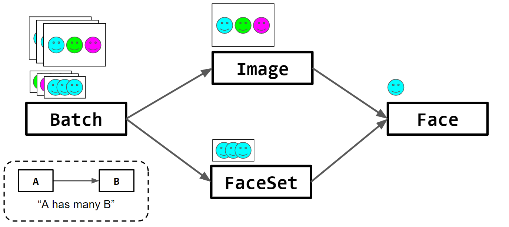

# face-aggregator


This is the final project for CIS 581, Computational Photography & Computer Vision, at the University of Pennsylvania.

# Introduction
Have you ever taken a series of group photos and there isn't one image where everyone is smiling? Of course you have! We have the solution for you! Upload how ever many pictures you want and our program will identify the happiest faces in each image and combine them.

# Setup
Install requirements
```
$ pip install -r requirements.txt
```
# Run
```
$ py main.py
```
Upon running the program, your file explorer will pop up allowing you select multiple images.

After selecting your images, you'll be asked to choose which one you want as the "scene" aka the image where all the faces will be placed onto. From there select the file name and you'll have our desired output image.

# See facial points using your webcam
```
$ py webcam.py
```
This handy command will open your webcam and plot the 68 facial features onto your face showing exactly how computers interpret faces.

# Design
We took an object-oriented approach to our design. The Batch class represents a directory of group photos to be operated on and has a list of Image objects and FaceSet objects. Each Image object represents a single group photo in the directory and has a list of individual Face objects. The Face object stores the bounding box, facial landmarks, and smile score of a face.  After the Batch, Images, and Faces have been created, the list of FaceSet objects is created, each of which stores all of the faces belonging to one person in the series.

The following figure illustrates these relationships. The Batch has three Image objects and each Image has three Face objects. The Batch also has three FaceSet objects, each of which has three Faces (one per person per photo).

